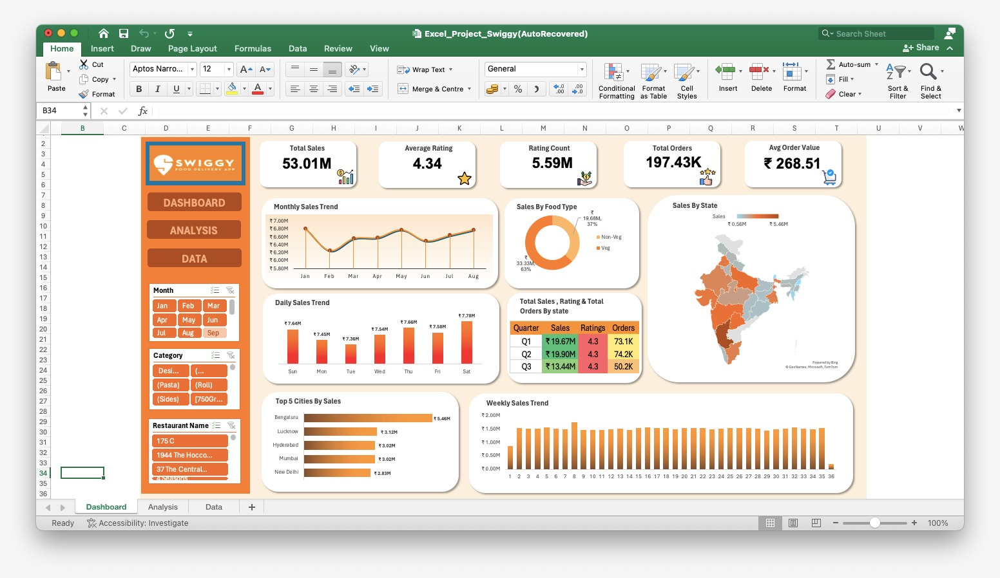

# 🍊 Swiggy Food Delivery Sales Dashboard — Excel Project



---

## 📌 Project Overview

An interactive Excel dashboard built to analyze **1,97,430 food delivery orders** from Swiggy across **28 states**, **28 cities**, **993 restaurants**, and **59,000+ dishes** — covering **8 months of data (January–August 2025)**.

The goal was to transform raw transactional data into clear, visual business insights that help understand sales performance, customer behavior, and geographic trends across India.

---

## 📁 Repository Structure

```
Swiggy-Excel-Dashboard/
│
├── 📂 data/
│   └── Excel_Project_Swiggy.xlsx       # Raw dataset + Dashboard file
│
├── 📂 images/
│   └── dashboard_preview.png           # Screenshot of the final dashboard
│
└── README.md                           # Project documentation
```

---

## 📊 Dataset Details

| Field | Details |
|---|---|
| Total Records | 1,97,430 rows |
| Total Columns | 14 |
| Columns | State, City, Order Date, Day, Quarter, Week, Restaurant Name, Location, Category, Dish Name, Food Type, Price (INR), Rating, Rating Count |
| Time Period | January 2025 – August 2025 |
| States Covered | 28 |
| Cities Covered | 28 |
| Unique Restaurants | 993 |
| Unique Dishes | 59,000+ |
| Unique Categories | 4,972 |

---

## 🔍 Key Insights

- 💰 **Total Revenue: ₹5.30 Crore** generated across 1,97,430 orders
- 🏙️ **Bengaluru leads** all cities with ₹54.6L in sales — highest among all 28 cities
- 🥗 **Veg dominates** at 63% of total sales vs 37% Non-Veg
- 📅 **Q2 was the peak quarter** — ₹1.99 Cr in sales with 74.2K orders
- 📆 **Saturday** is the highest revenue day of the week consistently
- ⭐ **Average customer rating: 4.34** — steady across all 3 quarters
- 💵 **Average Order Value: ₹268.51**
- 🏆 **Top 5 cities** — Bengaluru, Lucknow, Hyderabad, Mumbai, New Delhi — contribute **31% of total revenue**
- 📉 **Q3 dip observed** — ₹1.34 Cr (only 3 months: Jun–Aug) vs Q1 & Q2 full quarters

---

## 📋 Dashboard Features

| Feature | Description |
|---|---|
| 📦 KPI Cards | Total Sales · Total Orders · Avg Rating · Rating Count · Avg Order Value |
| 📈 Monthly Sales Trend | Line chart tracking revenue movement Jan–Aug |
| 📊 Daily Sales Trend | Bar chart showing performance by each day of the week |
| 📉 Weekly Sales Trend | 36-week sales breakdown across the year |
| 🍕 Sales by Food Type | Donut chart showing Veg vs Non-Veg revenue split |
| 🗺️ Sales by State | India filled map with state-level revenue heatmap |
| 🏙️ Top 5 Cities by Sales | Horizontal bar chart ranking top revenue cities |
| 📋 Quarterly Summary Table | Q1/Q2/Q3 breakdown — Sales, Ratings, Orders |
| 🎛️ Dynamic Slicers | Filter entire dashboard by Month, Category & Restaurant Name |

---

## 🛠️ Skills & Tools Used

| Tool | Usage |
|---|---|
| Microsoft Excel | Primary tool for entire project |
| Pivot Tables | Data summarization and aggregation |
| Pivot Charts | Visual representation of trends |
| Slicers | Interactive dashboard filtering |
| Conditional Formatting | Highlighting key metrics |
| Filled Map Chart | Geographic sales visualization |
| Data Cleaning | Handling raw transactional data |
| Dashboard Design | Layout, color theming, KPI cards |

---

## 📸 Dashboard Preview


---

## 🚀 How to Use

1. Clone or download this repository
2. Open `data/Excel_Project_Swiggy.xlsx`
3. Navigate to the **Dashboard** sheet
4. Use the **slicers** on the left panel to filter by:
   - 📅 Month
   - 🍽️ Category
   - 🏪 Restaurant Name
5. Explore the **Analysis** sheet for pivot table breakdowns
6. Explore the **Data** sheet for the complete raw dataset

---

## 📂 Sheets in the Excel File

| Sheet | Description |
|---|---|
| Dashboard | Final interactive dashboard with all charts and KPIs |
| Analysis | All analysis by Pivot tables used to power the dashboard |
| Data | Complete raw dataset with 1,97,430 rows |

---

## 👤 Author

**Vaibhav Deswal**
Aspiring Data Analyst | Excel · SQL · Power BI

🔗 [LinkedIn](((https://www.linkedin.com/in/vaibhavdeswal/))
📧 vaibhavdeswal001@gmail.com

---


